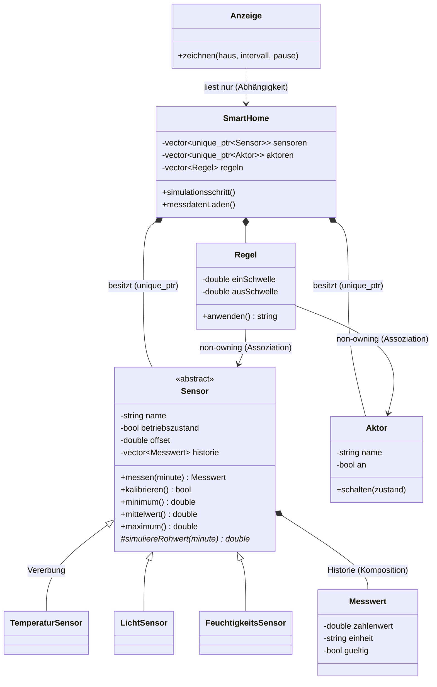

# Smart Sensor – Simulation smarter Sensoren im Eigenheim

Ein C++-Konsolenprogramm, das smarte Sensoren im Eigenheim simuliert
(Temperatur, Helligkeit, Luftfeuchte). Ein zentrales Smart-Home-System liest
die Sensoren zyklisch aus und **reagiert** über Regeln mit Aktoren: Wird es
kalt, schaltet die Heizung ein; wird es dunkel, geht das Gartenlicht an; ist
die Luft zu feucht, startet die Lüftung. Die Aktoren wirken dabei auf die
Simulation zurück (die Heizung wärmt den Raum wirklich auf), so dass ein
echter Regelkreis entsteht.

Alles wird live in einem farbigen Terminal-Dashboard angezeigt und zusätzlich
als CSV-Datei (`messdaten.csv`) protokolliert. Beim nächsten Programmstart wird
dieses Protokoll wieder **eingelesen** (fehlende Datei, unvollständige Zeilen,
unlesbare Zahlen und unplausible Werte werden abgefangen), sodass Statistik und
Verlaufskurven nahtlos an die letzte Sitzung anknüpfen.

```
┌────────────────────────────────────────────────────────────────────────────┐
│ SMART SENSOR · Smart-Home-Simulation        Tag 2 · 07:50  TAG  Takt 0.2 s │
├─ SENSOREN ─────────────────────────────────────────────────────────────────┤
│ [1] Temperatur Wohnzimmer     21.2 °C   █████████████░░░░░░░░░░░░   AKTIV  │
│     min 19.5 · Ø 23.7 · max 28.0 · Offset +1.6  █▇▆▇▇▅▆▆▄▅▄▅▃▃▄▃▂▃▂▂▁▁▂▁▁▂ │
│ [2] Helligkeit Garten          298 lx   ███████░░░░░░░░░░░░░░░░░░   AKTIV  │
│     min 38 · Ø 299 · max 889 · Offset +76  ▁▁▁▁▁▁▁▁▁▁▁▁▁▂▂▂▂▂▃▃▃▄▅▅▆▆▇▇███ │
│ [3] Luftfeuchte Bad           53.0 %    █████████████░░░░░░░░░░░░   AKTIV  │
├─ AKTOREN ──────────────────────────────────────────────────────────────────┤
│ Heizung  AUS  ×4   Gartenlicht  AUS  ×4   Lüftung  AUS  ×6                 │
├─ EREIGNISSE ───────────────────────────────────────────────────────────────┤
│ 07:40  Lüftung AUS – Luftfeuchte Bad 54.9 % < 55.0                         │
│ 07:35  Gartenlicht AUS – Helligkeit Garten 278 lx > 260                    │
└────────────────────────────────────────────────────────────────────────────┘
```

## Kompilieren und Ausführen

Voraussetzungen: C++17-Compiler (clang++ oder g++) und ein Terminal mit
mindestens 74 Spalten. Entwickelt für macOS/Linux (unter Windows: WSL).

```sh
make run          # kompilieren und starten
```

oder von Hand:

```sh
c++ -std=c++17 -Wall -Wextra -O2 -o smartsensor *.cpp
./smartsensor
```

*Nachweis Umgebung (A1): eingerichtet und getestet am 06.07.2026 unter macOS
(Apple clang 21, make); das Projekt baut ohne Warnungen (`-Wall -Wextra`) und läuft.*

## Bedienung

| Taste       | Funktion                                          |
| ----------- | ------------------------------------------------- |
| `1` – `3`   | Sensor außer Betrieb nehmen / wieder aktivieren   |
| `k`         | alle Sensoren kalibrieren (Offset-Drift zurücksetzen) |
| `+` / `-`   | Simulation schneller / langsamer                  |
| `Leertaste` | Pause                                             |
| `q`         | Beenden                                           |

Ein Simulationsschritt entspricht 5 Minuten; ein kompletter Tag mit
Tag-/Nachtverlauf dauert im Standardtempo ca. 3–4 Minuten.

## Aufbau des Programms

```
main.cpp        Programmstart: System zusammenbauen, Simulationsschleife
Messwert.h/.cpp Klasse Messwert (Zahlenwert, Einheit, Zeitpunkt, Gültigkeit)
Sensor.h/.cpp   abstrakte Basisklasse Sensor + TemperaturSensor,
                LichtSensor, FeuchtigkeitsSensor
SmartHome.h/.cpp Aktor, Regel und SmartHome (zentrale Steuerung, Ereignis-
                 protokoll, CSV-Datenspeicher)
Anzeige.h/.cpp  TerminalGuard (RAII) und Anzeige (ANSI-Dashboard, Eingaben)
```

### Klassendiagramm



## Verwendete OOP-Konzepte

| Konzept                              | Wo im Projekt                                                                 |
| ------------------------------------ | ----------------------------------------------------------------------------- |
| Klassen und Kapselung                | alle Klassen: private Attribute, Zugriff nur über Methoden                    |
| Konstruktoren (auch überladen)       | `Messwert` (Standard- + Parameterkonstruktor), Initialisierungslisten überall |
| Vererbung                            | `TemperaturSensor`, `LichtSensor`, `FeuchtigkeitsSensor` erben von `Sensor`   |
| Abstrakte Klasse / rein virtuell     | `Sensor::simuliereRohwert() = 0`                                              |
| Polymorphie (`virtual` / `override`) | `SmartHome` ruft `messen()`/`beeinflussen()` über `Sensor`-Basisklassenzeiger |
| Referenzen und `const`               | const-Getter, `const`-Referenzen als Parameter (`Anzeige::zeichnen`)          |
| Komposition vs. Assoziation          | `SmartHome` besitzt Sensoren/Aktoren (`unique_ptr`), `Regel` kennt sie nur (non-owning Zeiger) |
| Lebensdauer / RAII                   | `TerminalGuard` stellt das Terminal im Destruktor wieder her                  |
| Entwurfsmuster (Patterns)            | **Template Method**: `Sensor::messen()` steuert den festen Messablauf und ruft die rein virtuelle `simuliereRohwert()` der Unterklassen; **RAII** im `TerminalGuard` |
| Container der Standardbibliothek     | `std::vector` für Historie, Sensoren, Regeln, Ereignisse                      |
| Datenspeicher (Datei)                | Messwerte werden mit `std::ofstream` als CSV geschrieben und beim Start mit `std::ifstream` wieder eingelesen (`SmartHome::messdatenLaden`) |
| Fehlerbehandlung beim Einlesen       | defektes/fehlendes CSV wird abgefangen, ungültige Zeilen werden gezählt und übersprungen |
| Statistik als eigene Funktionen      | `Sensor::minimum()`, `maximum()`, `mittelwert()`                              |
| Plausibilitätsprüfung                | unplausible Messwerte werden erkannt, verworfen und als Störung gemeldet      |
| Grafische Darstellung                | Balkenanzeige + Verlaufskurve (Sparkline) je Sensor im Dashboard              |

## Bezug zur Vorbereitungsaufgabe (A3 Messwertauswertung)

| Anforderung A3                       | Umsetzung im Projekt                                                          |
| ------------------------------------ | ----------------------------------------------------------------------------- |
| ≥ 10 Gleitkomma-Messwerte verarbeiten | jeder Simulationstag erzeugt ~860 Messwerte (3 Sensoren × 288 Schritte); zusätzlich werden beim Start die Werte aus `messdaten.csv` verarbeitet |
| kleinster / größter Wert, Durchschnitt | `Sensor::minimum()`, `maximum()`, `mittelwert()` – jede Berechnung als eigenständige Funktion mit eigener Schleife und Bedingung |
| ein Array                            | `AKZENT[3]` und `BLOECKE[8]` in `Anzeige.cpp`; `std::vector` als dynamisches Array für die Messreihen |
| mehrere Dateien                      | `main.cpp` + vier Header-/Implementierungs-Paare                              |
| Standardbibliothek                   | `vector`, `string`, `fstream`, `chrono`, `random`, `algorithm`                |
| Abweichung                           | die Messwerte sind nicht fest im Code hinterlegt, sondern werden simuliert bzw. aus der CSV-Datei geladen – bewusste Weiterentwicklung der Aufgabe |

## Git im Projekt

Grundlagen in Kürze:

- **Git** – verteilte Versionskontrolle: verfolgt Änderungen, macht alte Stände
  wiederherstellbar und ermöglicht Zusammenarbeit im Team
- **Repository** – der Projektordner samt vollständiger Historie aller Versionen
- **Branches** – parallele Arbeitsstände; in diesem Projekt wird
  vereinbarungsgemäß nur der `main`-Branch verwendet

Verwendete Befehle:

- `git add` / `git commit` – Änderungen auswählen und als Version mit
  aussagekräftiger Nachricht sichern (gute Commit-Message: kurz, sagt *was*
  geändert wurde und *warum*)
- `git push` – lokale Commits zum Server übertragen
- `git pull` – den Stand des Servers in die Arbeitskopie übernehmen und bei
  Bedarf zusammenführen

### Erzeugter und gelöster Merge-Konflikt

- **Wo:** `README.md`, erste Zeile der Programmbeschreibung – bewusst in zwei
  Arbeitskopien unterschiedlich formuliert („im Eigenheim“ vs. „in einem Wohnhaus“)
- **Wie er sichtbar wurde:** Arbeitskopie 1 pushte zuerst (erfolgreich). Der Push
  aus Arbeitskopie 2 wurde abgelehnt (`! [rejected] main -> main (fetch first)`);
  das anschließende `git pull` meldete `CONFLICT (content): Merge conflict in
  README.md`, und Git schrieb Konfliktmarkierungen (`<<<<<<< HEAD`, `=======`,
  `>>>>>>>`) in die Datei
- **Lösung:** die Zeile von Hand zusammengeführt (Formulierung passend zum
  Titel), Markierungen entfernt, dann `git add README.md`, Merge-Commit und
  `git push` – nachvollziehbar in der Historie (Commits `92705fd` und `f3bf4e7`,
  Merge `8df0bd4`)

## Reflexion

<!-- Sätze 4-6 bei Bedarf an die eigene Erfahrung anpassen -->

Die Einrichtung der Entwicklungsumgebung unter macOS lief problemlos: clang++
und make waren über die Xcode Command Line Tools vorhanden, das Projekt ließ
sich sofort kompilieren und starten. Das größte technische Problem war ein
Fehler in der Terminal-Anzeige: ein Non-Blocking-Flag auf der Standardeingabe
wirkte auch auf die Ausgabe, sodass zunächst nur ein Sensor sichtbar war –
gelöst über den termios-Modus (`VMIN = 0`). Auch die Fehlerbehandlung beim
CSV-Einlesen (unvollständige Zeilen, unlesbare Zahlen, unplausible Werte) hat
mehr Sorgfalt gebraucht als gedacht. Besonders wiederholen musste ich Zeiger
und Referenzen sowie das Thema Besitz und Lebensdauer (`unique_ptr` vs.
non-owning Zeiger). Vererbung und `virtual`/`override` waren nach den Übungen
dagegen schnell wieder präsent. Noch unsicher bin ich bei Details der
UML-Notation (Aggregation vs. Komposition) und bei den ANSI-Escape-Sequenzen
der Anzeige, die über den Kursstoff hinausgehen. Der bewusst erzeugte
Merge-Konflikt hat geholfen, den Ablauf aus abgelehntem Push, Pull und
manueller Auflösung einmal komplett durchzuspielen.

## Team

- Victor Ziegler – **Einzelarbeit**: Konzept, Kernsystem, Sensoren und Regeln,
  Anzeige, CSV-Datenspeicher und Dokumentation aus einer Hand (eine
  Aufgabenverteilung im Team entfällt daher)

Repository: <https://github.com/vctrzglr/smartsensor>
